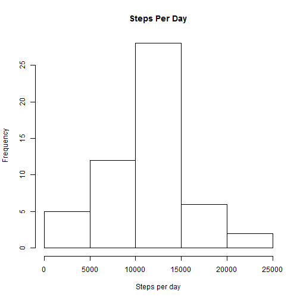
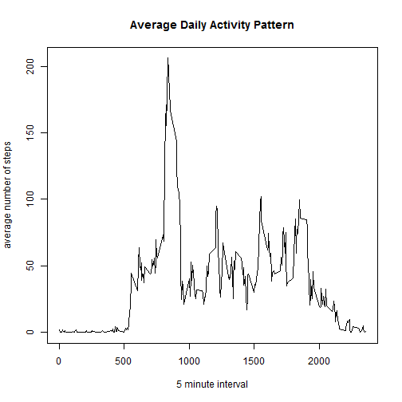
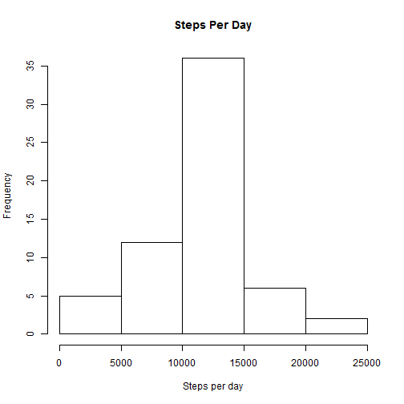
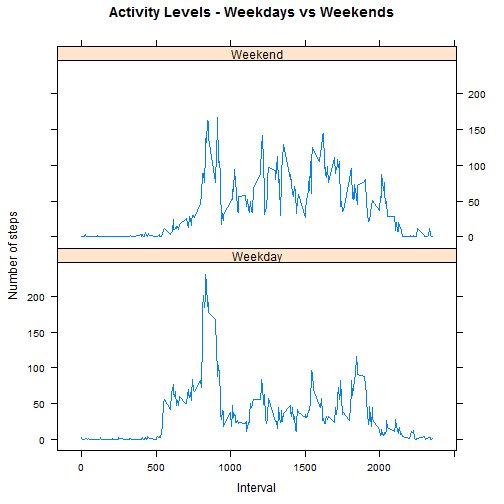

# Reproducible Research: Peer Assessment 1


## Loading and preprocessing the data
Following steps are performed

1. Unzip the archive
2. Read the csv file
3. Set the date column to date class

```r
unzip(zipfile = "activity.zip")
df <- read.csv("activity.csv")
df$date = as.Date(as.character(df$date))
```

## What is mean total number of steps taken per day?

```r
dailysteps <- aggregate(steps ~ date, data = df, FUN = sum)
mean(dailysteps$steps)
```

```
## [1] 10766
```

```r
median(dailysteps$steps)
```

```
## [1] 10765
```

```r
hist(dailysteps$steps, xlab = "Steps per day", main = "Steps Per Day", )
```

 

__Mean : 1.0766 &times; 10<sup>4</sup>__

__Median : 10765__

## What is the average daily activity pattern?

```r
activitypattern <- aggregate(steps ~ interval, data = df, FUN = mean)
maxsteps <- max(activitypattern$steps)
activitypattern[activitypattern$steps == maxsteps, "interval"]
```

```
## [1] 835
```

```r
plot(x = activitypattern$interval, y = activitypattern$steps, type = "l", main = "Average Daily Activity Pattern", 
    xlab = "5 minute interval", ylab = "average number of steps")
```

 

__The maximum average number of steps (206.1698) are taken in interval 835__


## Imputing missing values
We have 2304 records with missing values. We have been suggested two ways to replace missing values

1. Replace missing step data for an interval with daily average for that interval
2. Replace missing step data for an interval with that day's average

Lets use the interval average over all days to replace a missing steps count for an interval. In other words, lets use method 1.


```r
missing_values <- is.na(df$steps)
missing_intervals <- df$interval[missing_values]
input_steps <- activitypattern$steps[match(missing_intervals, activitypattern$interval)]
corrected_df <- df
corrected_df$steps[missing_values] <- input_steps
```

Lets recalculate the mean and median with the corrected data.

```r
corrected_dailysteps <- aggregate(steps ~ date, corrected_df, sum)
mean(corrected_dailysteps$steps)
```

```
## [1] 10766
```

```r
median(corrected_dailysteps$steps)
```

```
## [1] 10766
```

```r
hist(corrected_dailysteps$steps, xlab = "Steps per day", main = "Steps Per Day")
```

 

__Mean : 1.0766 &times; 10<sup>4</sup>__

__Median : 1.0766 &times; 10<sup>4</sup>__

## Are there differences in activity patterns between weekdays and weekends?
Lets compare activity levels on weekdays and weekends


```r
corrected_df$day_type <- "Weekday"
weekends <- c("Saturday", "Sunday")
corrected_df$day_type[weekdays(corrected_df$date) %in% weekends] <- "Weekend"
corrected_df$day_type <- as.factor(corrected_df$day_type)
```


```r
corrected_activitypattern <- aggregate(steps ~ interval + day_type, corrected_df, 
    mean)
library(lattice)
xyplot(corrected_activitypattern$steps ~ corrected_activitypattern$interval | 
    corrected_activitypattern$day_type, type = "l", layout = c(1, 2), main = "Activity Levels - Weekdays vs Weekends", 
    xlab = "Interval", ylab = "Number of steps")
```

 

